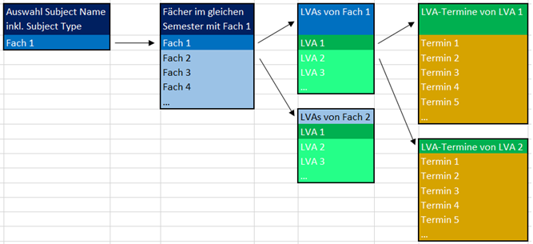

==== 1. 	Instituts-Tool ====
===== 1.1. 	Anforderungen =====
====== 1.1.1. 	Kalendarische Darstellung ======
Hinsichtlich der Übersichtlichkeit ist zusätzlich eine kalendarische Ansicht der Terminkollisionen wünschenswert.
Die Umsetzung der Anforderung soll es ermöglichen, nicht belegte Zeitfenster leichter erkennen zu können.
Die Form der Visualisierung unterliegt keinen Restriktionen und kann frei gewählt werden.

====== 1.1.1.1. 	Informationsbedarf ======
Nach Rücksprache mit dem Sekretariat wäre eine kalendarische Ansicht aller LVA-Termine wünschenswert, um freie
Zeitfenster für Verschiebungen von LVA-Terminen zu finden. Aus Sicht des idealtypischen Studienverlaufes sind bei einer
Verschiebung eines LVA-Termins nur jene Lehrveranstaltungen zu berücksichtigen, die sich im gleichen Semester des
idealtypischen Studienverlaufs befinden.

====== 1.1.1.2. 	Abfrage ======
Die Ausgangsbasis für die Abfrage einer kalendarischen Ansicht ist ein konkretes Fach (Subject Name) inklusive Kursttyp
(Subject Type), welches verschoben werden soll. Nach Auswahl des zu verschiebenden Faches werden sämtliche Fächer
ermittelt, die im idealtypischen Studienverlauf im gleichen Semester absolviert werden.

Zum Beispiel soll eine LVA des Faches Einführung in die Wirtschaftsinformatik verschoben werden:

Demzufolge sind alle LVA-Termine des Winter Semesters 1 und alle Termine des Sommer Semesters 1 im Kalender anzuzeigen
(In diesem Fall wird je nach Winter- bzw. Sommerplanung nur das Winter- bzw. Sommersemester relevant sein).

====== 1.1.1.3. 	Ausgabe ======
Im Kalender werden alle Fächer angezeigt, die von der Verschiebung potentiell betroffen sein könnten, sprich es werden
alle LVA-Termine der betroffenen Fächer angezeigt.

====== 1.1.1.4. 	Beispiel-Ansicht ======

====== 1.1.1.5. 	Farbliche Differenzierung (optional) =====
Die Termine werden je nach Selektion wie folgt eingefärbt:

==== 2. 	Studenten-Tool ====
===== 2.1. 	Anforderungen =====
====== 2.1.1. 	Kalendarische Darstellung ======
Die Studierenden benötigen eine visuelle Möglichkeit, um je Semester (Semester von 1 bis 6 und Unterscheidung zwischen
beginnend im Winter- oder Sommersemester) das Lehrveranstaltungsangebot überblicken zu können. Mit dem idealtypischen
Studienplan in einer kalendarischen Ansicht wird die Semesterplanung wesentlich erleichtert und fördert einen
komprimierten Stundenplan. Die Form der Visualisierung unterliegt keinen Restriktionen und kann frei gewählt werden.

====== 2.1.1.1. 	Informationsbedarf ======
Dem Studierenden werden sämtliche Lehrveranstaltungs-Termine basierend auf der Auswahl des Startsemesters und des
ausgewählten Semesters im Kalender angezeigt. Je Fach existieren mehrere Lehrveranstaltungen, die natürlich nicht
mehrfach besucht werden müssen, jedoch kann durch eine umfassende Visualisierung aller möglichen Kurstermine der
Student selbst entscheiden welche Lehrveranstaltung am besten in seine Zeitplanung passt. Die Ansicht beinhaltet nur
Fächer des idealtypischen Studienplans und kann nicht um bereits absolvierte Fächer reduziert oder noch nicht
bestandene Fächer erweitert werden.

====== 2.1.1.2. 	Abfrage ======
Die Ausgangsbasis für die Abfrage ist das ausgewählte Startsemester und das ausgewählte Startsemester.
Nach Auswahl der Kriterien werden sämtliche Fächer ermittelt, die im idealtypischen Studienverlauf enthalten sind.

image::cal_08.png[]

Zum Beispiel soll eine LVA des Faches Einführung in die Wirtschaftsinformatik verschoben werden:

Demzufolge sind alle LVA-Termine des Winter Semesters 1 anzuzeigen.

====== 2.1.1.3. 	Ausgabe ======
Im Kalender werden alle LVA-Termine angezeigt, die im ausgewählten Semester stattfinden.

====== 2.1.1.4. 	Beispiel-Ansicht ======

====== 2.1.2. 	Individuelle LVA-Auswahl ======
Die Studierenden befinden sich nicht immer zwingend im idealtypischen Studienverlauf. Resultierend aus dem
unterschiedlichen Studienfortschritt der einzelnen Studenten entwickelt sich das Bedürfnis eine individuelle Auswahl
der Lehrveranstaltungen je Semester zu treffen. Ein Feature für die individuelle Auswahl aus dem gesamten
Lehrveranstaltungsangebot für WIN Bachelor wäre wünschenswert.

====== 2.1.2.1. 	Informationsbedarf ======
Basierend auf der kalendarischen Darstellung des idealtypischen Studienverlaufs wird dem Studenten die Möglichkeit
geboten mittels Checkboxes die bereits absolvierten Fächer abzuwählen und Fächer aus anderen idealtypischen Semestern
hinzuzufügen.

====== 2.1.2.2. 	Abfrage ======
Zu allen ausgewählten Fächern werden sämtliche Lehrveranstaltungen und die dazugehörigen Termine ermittelt.

====== 2.1.2.3. 	Ausgabe ======
Im Kalender werden alle LVA-Termine der ausgewählten Fächer angezeigt.

====== 2.1.2.4. 	Beispiel-Ansicht ======

===== 2.1.3. 	Individuelle Zeitfenster für LVA-Planung =====
Vorwiegend für Studierende, die ihr Studium berufsbegleitend absolvieren ist es wünschenswert ein Feature anzubieten,
das die Parametrisierung von individuellen Zeitfenstern für den Studierenden zulässt. Dem Studierenden werden nach der
Einstellung nur noch für sie/ihn relevante Lehrveranstaltungen angezeigt, die zu arbeitsfreien Zeiten und Tagen
stattfinden.

