== Problemlösungsweg ==

=== Berechnungsgrundlage ===
Vor der Implementierung der Applikation musste in erster Linie eine Berechnungsgrundlage bzw. Berechnungslogik entwickelt werden, nach welcher die Anwendung Terminkollisionen bewerten soll.
Grundidee war es die Kollisionsberechnung in fünf Ebenen (Levels) aufzuteilen.
Die Berechnung beginnt auf der untersten Ebene (Ebene 5 - Kollisionen) und wird Bottom-up bis zur Ebene 1 (Fach X) hochaggregiert. Zur Bearbeitung der Kollisionen beziehungsweise die gesamte Anzeige wurde mittels Top-down Prinzip dargestellt, um auf Fach-Ebene (Fach X) auf einen Blick die Fächer zu erkennen, die die höchsten Kollisionswerte aufweisen.

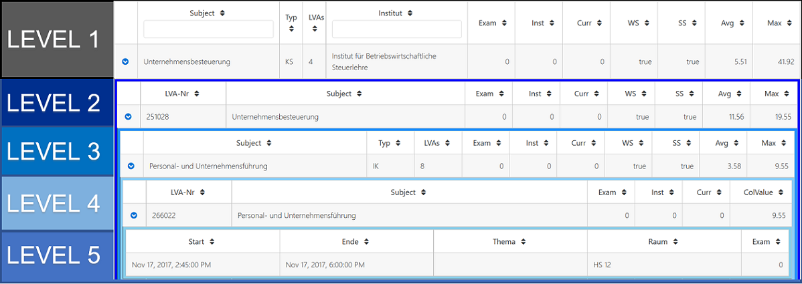

=== LEVEL 5 (Kollisionen) ===
Jedes Fach (Level 1) besitzt eine oder mehrere Lehrveranstaltungen (Level 2). Jede Lehrveranstaltung (Level 2), die sich mit einer anderen Lehrveranstaltung (Level 4) überschneidet und im gleichen Semester des idealtypischen Studienverlaufes befindet wird auf Kollisionen untersucht. Um auch eine aggregierte Sicht aller betroffenen Lehrveranstaltungen (Level 4) darstellen zu können wurde eine weiter Ebene (Level 3) eingeführt, die auf Fach-Ebene sämtliche kollidierenden Lehrveranstaltungen zusammenfasst.

Auf Level 5 werden die einzelnen kollidierenden Termine zweier Lehrveranstaltungen angezeigt.

**Zum Beispiel LVA Y von Fach X wird mit LVA U von Fach V verglichen.**

* **Level 1 = Fach X**

* **Level 2 = LVA Y**

* **Level 3 = Fach V**

* **Level 4 = LVA U**

* **Level 5 = Terminkollisionen zwischen LVA Y und LVA U**

In der Applikation werden alle kollidierenden Termine auf Ebene 5 wie folgt angezeigt:

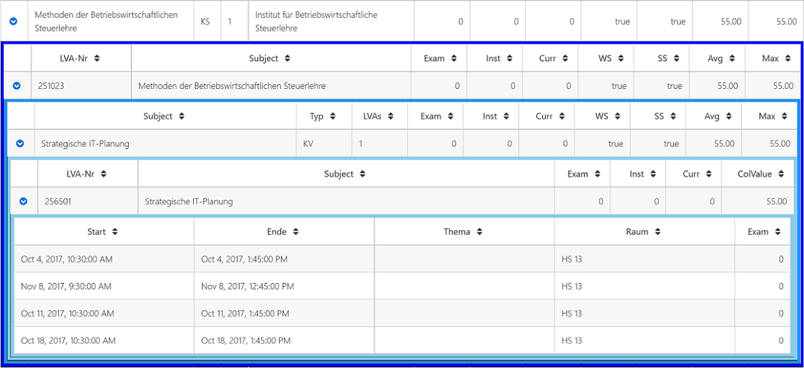

==== LEVEL 5 – Start ====
Beginn (Datum & Zeit) des Termins von LVA Y (Level 2)

==== LEVEL 5 - Ende ====
Ende (Datum & Zeit) des Termins von LVA Y (Level 2)

==== LEVEL 5 - Thema ====
Beschreibung des Inhaltes des LVA-Termins

==== LEVEL 5 - Raum ====
Hörsaal oder Raum in dem der LVA-Termin abgehalten wird

==== LEVEL 5 - Exam ====
Falls es sich um eine Terminkollision handelt und beide Termine, die miteinander verglichen werden, ein Klausurtermin sind, so wird diese Kollision als Klausurkollision gekennzeichnet.

Wenn beide Einzeltermine ein Klausurtermin sind, dann wird der Wert auf 1 gestellt, sonst auf 0.

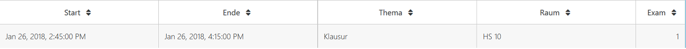

Die Kriterien ob es sich um einen Klausurtermin handelt gestalten sich wie folgt:

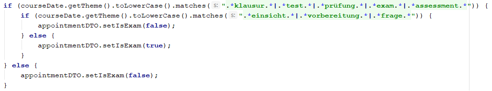

Beinhaltet das Thema des LVA-Termin einen der folgenden Suchbegriffe

* **Prüfung**

* **Klausur**

* **Exam**

* **Test**

* **Assessment**

außer das Thema des Termins beinhaltet auch einen der folgenden Begriffe

* **Vorbereitung**

* **Einsicht**

* **Frage**

dann wird dieser Termin als Klausurkollision gekennzeichnet.

==== LEVEL 4 (LVA U des Faches V) ====
Level 4 betrachtet LVA U des Faches V. Ziel von Level 4 ist es basierend auf den Werten von Level 5 eine aggregierte Sicht auf LVA-Sicht zu generieren. Alle Termin-Kollisionen werden mittels Gruppierungsmerkmal (LVA-Nr) summiert und mit nachfolgender Kollisionswertermittlung (ColValue) bewertet.

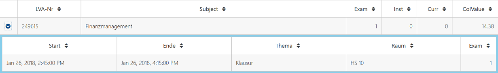

==== LEVEL 4 – LVA-Nr ====
Die LVA-Nr dient vor allem als Gruppierungsmerkmal und Identifier für die Aggregation der Termine auf Level 5.

==== LEVEL 4 - Subject ====
Bezeichnung des Faches V

==== LEVEL 4 - Exam ====
Die Spalte Exam summiert alle Klausurkollisionen der darunterliegenden Ebene (Level 5).

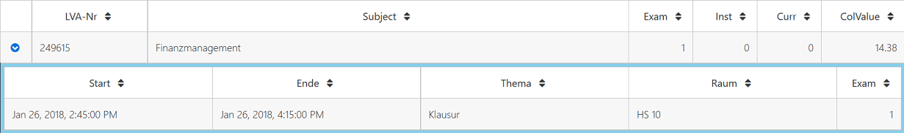

__Zum Beispiel die LVA 249615 weist in der Spalte Exam einen Wert von 1 auf. Auf der darunterliegenden Ebene (Level 5 – Kollisionen) wird eine LVA mit 1 Klausurkollision ausgegeben.__

==== LEVEL 4 - Inst ====
Falls LVA X und LVA U vom gleichen Institut abgehalten werden, so wird in dieser Spalte die Anzahl der betroffenen Termine angezeigt.

==== LEVEL 4 - Curr ====
Falls LVA X und LVA U vom gleichen Curriculum abgehalten werden, so wird in dieser Spalte die Anzahl der betroffenen Termine angezeigt.

Im Studiengang Wirtschaftsinformatik werden alle Kollisionen zwischen folgenden Instituten berücksichtigt:

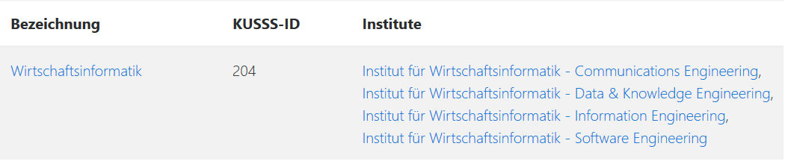

==== LEVEL 4 - ColValue ====

**1) CollisionType **

Um die Priorität der kollidieren LVAs in die Bewertung miteinzubeziehen werden die LVAs Überkategorien zugeordnet:

* **WIN** = LVA wird von einem WIN-Institut (CE, SE, DKE, IE) durchgeführt

* **EZK** = LVA wird für WIN exklusive zugekauft

* **ZK** = LVA wird zugekauft, wird aber mit anderen Studienrichtungen gemeinsam besucht

Somit können folgende LVA-Kollisions-Kombinationen eintreten:

* **INST_INST** = WIN-LVA kollidiert mit WIN-LVA und beide LVAs werden vom gleichen Institut durchgeführt

* **WIN_WIN** = WIN-LVA kollidiert mit WIN-LVA und beide LVAs werden nicht vom gleichen Institut durchgeführt

* **WIN_EZK** = WIN-LVA kollidiert mit EZK-LVA

* **EZK_EZK** = EZK-LVA kollidiert mit EZK-LVA

* **WIN_ZK** = WIN-LVA kollidiert mit ZK-LVA

* **EZK_ZK** = EZK-LVA kollidiert mit ZK-LVA

* **ZK_ZK** = ZK-LVA kollidiert mit ZK-LVA

Die LVA-Kollisions-Kombinationen werden mit Faktorwerten belegt, die in weiterer Folge in die Kollisionswert-Berechnung einfließen:

INST_INST = 100, WIN_WIN = 80, WIN_EZK = 70, EZK_EZK = 60, WIN_ZK = 30, EZK_ZK = 20, ZK_ZK = 10

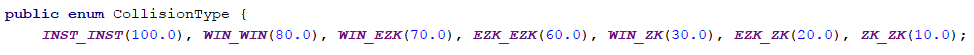

**2) Maximalwert**

Der Maximalwert bestimmt den maximalen Kollisionswert den die LVA X (Level 2) erreichen kann und dient als Basis für die normierte Berechnung (Skala 0 bis 100).

Jeder Termin der LVA könnte theoretisch mit der zweiten LVA kollidieren. Für jeden Termin wird eine potentielle Kollision mit dem Wert 100 berechnet.

__Z.B. die LVA besitzt 13 Termine = 13 * 100 = 1300 = Terminkollisionswert__

Jeder Klausurtermin der LVA (Level 2) könnte mit einer Klausur der kollidierenden LVA (Level 4) kollidieren. Für jede potentielle Klausurkollision wird zusätzlich ein Wert von 200 addiert.

__Z.B. die LVA besitzt 2 Klausurtermine = 2 * 200 = 400 = Klausurkollisionswert__

Der Terminkollisionswert und der Klausurkollisionswert werden addiert.

**Terminkollisionswert + Klausurkollisionswert = Maximalwert1**

__1300 + 400 = 1700__

Um den Kollisionswert schlussendlich auch nach seiner Priorität gewichten zu können wird dieser zu 50 Prozent aus den Kollisionen errechnet (Maximalwert1) und zu 50 Prozent auf Basis des Kollisionstyps (CollisionType bzw. Faktorwert).

Der Maximalwert1 wird mit 2 multipliziert, um in weiterer Folge zu 50 % die Kollisionen und zu 50 % die Kollisions-Art zu gewichten.

**Maximalwert1 * 2 = Maximalwert**

__1700 * 2 = 3400__

**Formel für Maximalwertberechnung:**

**(Anzahl der Termine von LVA X * 100 + Anzahl der Klausurtermine von LVA X * 200) * 2 = Maximalwert**

__(13 * 100 + 2 * 200) * 2 = 3400__

**3) Kollisionswert**
Der Kollisionswert bestimmt den absoluten Wert der kollidierenden Termine und Klausurtermine inklusive einer Gewichtung je nach Kollisions-Typ.

Jede Terminkollision wird mit Wert 100 angesetzt. __Z.B. die LVA besitzt 4 Terminkollisionen = 4 * 100 = 400__

Jede Klausurkollision wird mit Wert 200 angesetzt. __Z.B. die LVA besitzt 1 Klausurkollision = 1 * 200 = 200__

__400 + 200 = 600 = Kollisionswert1__

Mit Hilfe des CollisionTypeValues werden die restlichen 50 % des Kollisionswertes berechnet. Z.B. WIN_WIN --> CollisionTypeValue = 80

__Maximalwert / 2 * CollisionTypeValue / 100 = Kollisionswert2__

__3400 / 2 * 80 / 100 = 1360__

__Kollisionswert1 + Kollisionswert2 = 600 + 1360 = 1960 = Kollisionswert__

**Formel für Kollisionswertberechnung:**

**Anzahl der Terminkollisionen von LVA X * 100 + Anzahl der Klausurkollisionen von LVA X * 200 +
Maximalwert / 2 * CollisionTypeValue / 100 = Kollisionswert**

**4) Kollisionswert normiert (Skala 0 bis 100)**
Der ColValue gibt einen normierten Wert des Kollisionswertes auf Basis des Maximalwertes an.

**Formel für ColValue:**

**Kollisionswert / Maximalwert * 100 = ColValue**

__Z.B. 1960 / 3400 * 100 = 57,65__

==== LEVEL 3(Fach V) ====
Ziel von Level 3 ist es basierend auf den Werten von Level 4 eine aggregierte Sicht auf Fach-Sicht zu generieren. Alle LVAs (Level 4) werden mittels Gruppierungsmerkmal (Subject) aggregiert dargestellt.

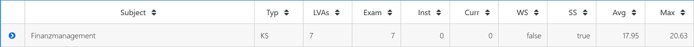

==== LEVEL 3 - Subject ====
Das Subject beziehungsweise Fach ist die Bezeichnung des Fachs und beinhaltet alle LVAs mit dieser Bezeichnung und Kurstyp.

==== LEVEL 3 - Typ ====
Der Typ beziehungsweise Kurstyp zeigt um welchen Typ von Lehrveranstaltung es sich handelt wie z.B. UE für Übung, VL für Vorlesung, etc.

==== LEVEL 3 - LVAs ====
Die Spalte LVAs gibt an wie viele Lehrveranstaltungen dieses Faches von einer Terminkollision betroffen sind. Zusätzlich wird angezeigt wie viele Lehrveranstaltungen von diesem Fach angeboten werden.

#1 = Anzahl LVAs von Kollision betroffen

#2 = Anzahl angebotene LVAs

Die Anzeige wird in folgendem Format ausgegeben:
#1 von #2

==== LEVEL 3 - Exam ====
Die Spalte Exam summiert alle Klausurkollisionen der darunterliegenden Ebene.

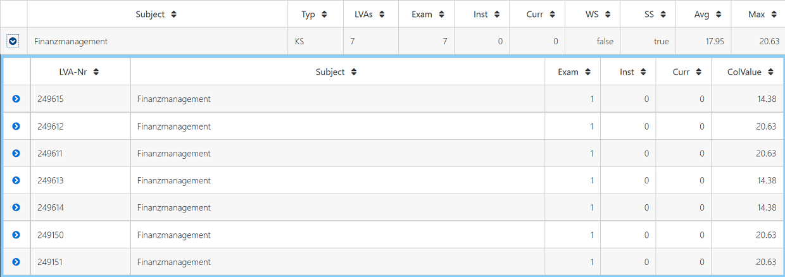

__Zum Beispiel das Fach Finanzmanagement mit Kurstyp KS weist in der Spalte Exam einen Wert von 7 aus. Auf der darunterliegenden Ebene (Level 4) werden 7 LVAs mit jeweils 1 Klausurkollision ausgegeben.__

__1 + 1 + 1 + 1 + 1 + 1 + 1 = 7__

==== LEVEL 3 - Inst ====
Summe der Instituts-Kollisionen aus Level 4

==== LEVEL 3 - Curr ====
Summe der Curriculum-Kollisionen aus Level 4

==== LEVEL 3 - WS ====
Die Spalte WS gibt an, ob es sich um Kollisionen handelt, die den idealtypischen Studienplan beginnend mit Wintersemester betreffen.

==== LEVEL 3 - SS ====
Die Spalte SS gibt an, ob es sich um Kollisionen handelt, die den idealtypischen Studienplan beginnend mit Sommersemester betreffen.

==== LEVEL 3 - Avg ====
Basierend auf Level 4 wird ein durchschnittlicher ColValue aus den darunterliegenden LVAs berechnet.

**Formel für Avg:**

**Summe aller ColValues / Anzahl aller betroffener LVAs = Avg**

__Zum Beispiel existieren auf Level 4 drei kollidierende LVAs. Davon weisen die LVAs folgende ColValues auf: LVA1 20.00, LVA2 50.00 und LVA3 60.00__

__Avg = (20.00 + 50.00 + 60.00) / 3 = 43.33__

==== LEVEL 3 - Max ====
Basierend auf Level 4 wird der größte ColValue aus den darunterliegenden LVAs gespeichert.

__Zum Beispiel existieren auf Level 4 drei kollidierende LVAs. Davon weisen die LVAs folgende ColValues auf: LVA1 20.00, LVA2 50.00 und LVA3 60.00__

__Max = 60.00__

==== LEVEL 2 (Fach 1 - LVA) ====
Level 2 betrachtet LVA X des Faches V. Ziel von Level 2 ist es basierend auf den Werten von Level 3 eine aggregierte Sicht auf LVA-Ebene zu generieren.

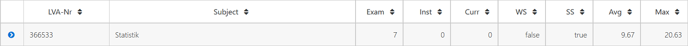

==== LEVEL 2 – LVA-Nr ====
Die LVA-Nr dient vor allem als Gruppierungsmerkmal und Identifier für die Aggregation der Termine auf Level 3.

==== LEVEL 2 - Subject ====
Bezeichnung des Faches Y

==== LEVEL 2 - Exam ====
Die Spalte Exam summiert alle Klausurkollisionen der darunterliegenden Ebene (Level 3).

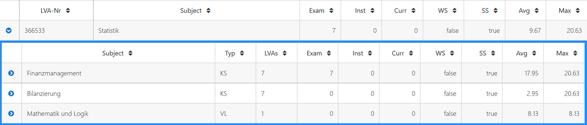

__Zum Beispiel die LVA 366533 weist in der Spalte Exam einen Wert von 7 auf (Summe aus den 3 LVAs Finanzmanagement, Bilanzierung und Mathematik und Logik). Auf der darunterliegenden Ebene (Level 3) werden eine LVA mit 7 Klausurkollision und 2 LVAs mit 0 Klausurkollisionen ausgegeben.__

__7 + 0 + 0 = 7__

==== LEVEL 2 - Inst ====
Summe der Instituts-Kollisionen aus Level 3

==== LEVEL 2 - Curr ====
Summe der Curriculum-Kollisionen aus Level 3

==== LEVEL 2 - WS ====
Die Spalte WS gibt an, ob in der darunterliegenden Ebene (Level 3) ein Fach existiert, das den Wert „true“ in der Spalte WS besitzt.

==== LEVEL 2 - SS ====
Die Spalte SS gibt an, ob in der darunterliegenden Ebene (Level 3) ein Fach existiert, das den Wert „true“ in der Spalte SS besitzt.

==== LEVEL 2 - Avg ====
Basierend auf Level 3 wird ein durchschnittlicher ColValue aus den darunterliegenden Fächern berechnet.

**Formel für Avg:**

**Summe aller Avg-Werte / Anzahl aller betroffenen Fächer = Avg**

__Zum Beispiel existieren auf Level 3 drei kollidierende Fächer. Davon weisen die Fächer folgende Avg-Werte auf: Fach1 20.00, Fach2 50.00 und Fach3 60.00__

__Avg = (20.00 + 50.00 + 60.00) / 3 = 43.33__

==== LEVEL 2 - Max ====
Basierend auf Level 3 wird der größte Max-Wert aus den darunterliegenden Fächern gespeichert.

__Zum Beispiel existieren auf Level 3 drei kollidierende Fächer. Davon weisen die Fächer folgende Max-Werte auf: Fach1 20.00, Fach2 50.00 und Fach3 60.00__

__Max = 60.00__

==== LEVEL 1 (Fach Y) ====
Auf Ebene 1 wird ermittelt wie viele Lehrveranstaltungen des Faches mit anderen Fächern kollidieren. Auf Basis der darunterliegenden Ebene (Level 2) werden sämtliche Werte hochaggregiert und wie folgt ermittelt.

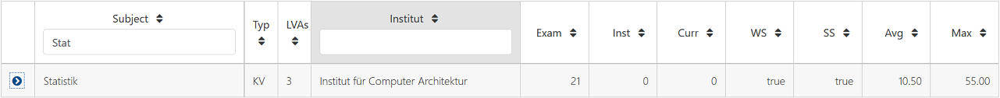

==== LEVEL 1 – Subject ====
Das Subject beziehungsweise Fach ist die Bezeichnung des Fachs und beinhaltet alle LVAs mit dieser Bezeichnung und Kurstyp. Die Applikation bietet eine Suchmöglichkeit nach Fachbezeichnung, um eine bestimmtes Fach schneller zu finden.

==== LEVEL 1 - Typ ====
Der Typ beziehungsweise Kurstyp zeigt um welchen Typ von Lehrveranstaltung es sich handelt wie z.B. UE für Übung, VL für Vorlesung, etc.

==== LEVEL 1 - LVAs ====
Die Spalte LVAs gibt an wie viele Lehrveranstaltungen dieses Faches von einer Terminkollision betroffen sind. Zusätzlich wird angezeigt wie viele Lehrveranstaltungen von diesem Fach angeboten werden.

#1 = Anzahl LVAs von Kollision betroffen

#2 = Anzahl angebotene LVAs

Die Anzeige wird in folgendem Format ausgegeben:
#1 von #2

==== LEVEL 1 - Institut ====
Das Institut gibt an von welchem Institut dieses Fach abgehalten wird. Die Applikation bietet eine Suchmöglichkeit beziehungsweise Filtermöglichkeit, um dem Institut eine Einschränkung auf relevante Fächer vornehmen zu können.

==== LEVEL 1 - Exam ====
Die Spalte Exam summiert alle Klausurkollisionen der darunterliegenden Ebene (Level 2).

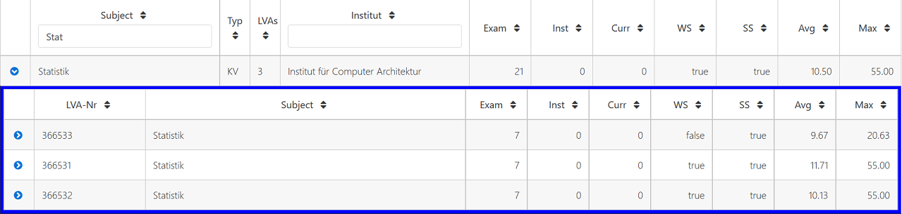

__Zum Beispiel das Fach Statistik mit Kurstyp KV weist in der Spalte Exam einen Wert von 21 aus. Auf der darunterliegenden Ebene (Level 2 – LVAs des Faches) werden 3 LVAs mit jeweils 7 Klausurkollisionen ausgegeben.__

__7 + 7 + 7 = 21__

==== LEVEL 1 - Inst ====
Summe der Instituts-Kollisionen aus Level 2

==== LEVEL 1 - Curr ====
Summe der Curriculum-Kollisionen aus Level 2

==== LEVEL 1 - WS ====
Die Spalte WS gibt an, ob in der darunterliegenden Ebene (Level 2) eine LVA existiert, die den Wert „true“ in der Spalte WS besitzt.

==== LEVEL 1 - SS ====
Die Spalte SS gibt an, ob in der darunterliegenden Ebene (Level 2) eine LVA existiert, die den Wert „true“ in der Spalte SS besitzt.

==== LEVEL 1 - Avg ====
Basierend auf Level 2 wird ein durchschnittlicher ColValue aus den darunterliegenden LVAs berechnet.

**Formel für Avg:**

**Summe aller Avg-Werte / Anzahl aller betroffenen LVAs = Avg**

__Zum Beispiel existieren auf Level 2 drei kollidierende LVAs. Davon weisen die LVAs folgende Avg-Werte auf: LVA1 20.00, LVA2 50.00 und LVA3 60.00__

__Avg = (20.00 + 50.00 + 60.00) / 3 = 43.33__

==== LEVEL 1 - Max ====
Basierend auf Level 2 wird der größte Max-Wert aus den darunterliegenden LVAs gespeichert.

__Zum Beispiel existieren auf Level 2 drei kollidierende LVAs. Davon weisen die LVAs folgende Max-Werte auf: LVA1 20.00, LVA2 50.00 und LVA3 60.00__

__Max = 60.00__

=== Auswahl geeigneter Frameworks ===

=== Dokumentation ===
Die Dokumentation des Projektes wird zum Teil parallel zur Umsetzung betrieben und untergliedert sich in 3 Teilbereiche:

* Allgemeine Projektdokumentation

* javdoc - Sourcecode-Dokumentation

* Dokumentation der REST-Attribute
